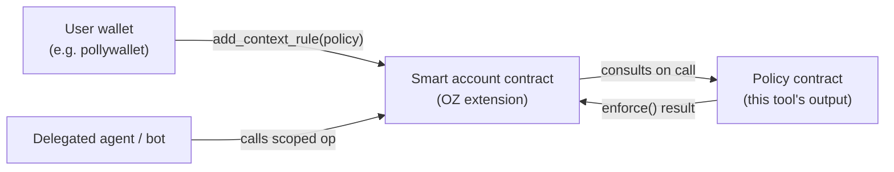
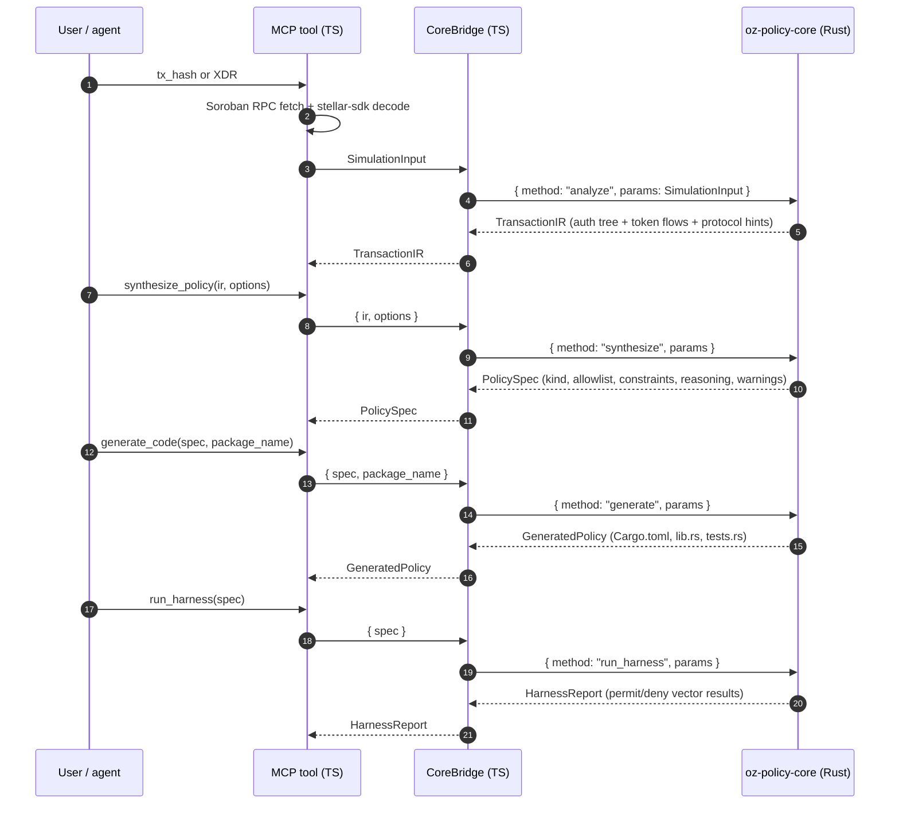

# Architecture

This document describes what's actually in the repo and how the pieces talk to
each other. It's the reference for someone who needs to audit, extend, or
embed the system. For the synthesizer's branching logic see
`synthesizer-decisions.md`; for wallet wiring see `wallet-integration.md`.

## What the system is

A pipeline that turns a Stellar transaction into an OpenZeppelin smart account
policy. You hand it a tx hash (or a simulated XDR), it parses the auth tree,
classifies the call into one of four policy kinds, and emits a Rust crate
plus a permit/deny test report. Nothing is deployed by the tool.

Four stages, in order: **observe** (TypeScript) → **synthesize** (Rust) →
**generate** (Rust) → **harness** (Rust). A fifth step — compiling, signing,
submitting — is the operator's job and is not automated.

## Stellar integration

This is a Soroban-only system. Every part of the pipeline depends on Stellar
primitives; there is no chain-abstracted layer and no plan to add one.

### Soroban primitives the tool consumes

- **Soroban RPC** (`getTransaction`, `simulateTransaction`). The observe
  tools call mainnet at `https://mainnet.sorobanrpc.com`, testnet at
  `https://soroban-testnet.stellar.org`, and futurenet at
  `https://rpc-futurenet.stellar.org` (defined in
  `packages/mcp-server/src/rpc.ts`).
- **`SorobanAuthorizationEntry`** and **`SorobanAuthorizedInvocation`**.
  These XDR types are the input that everything else is derived from. The
  observe tools walk the invocation tree (root + `subInvocations`) and
  emit a flat `AuthNode[]` for the Rust core.
- **`SorobanCredentials::Address`**. Each non-source authorization is keyed
  off a Stellar `Address` (G... or C...). The synthesizer treats unique
  addresses as distinct signers when deciding between `SimpleThreshold` and
  `WeightedThreshold`.
- **`ScVal`** as the argument value type. The TS side decodes
  `xdr.ScVal.fromXDR(...)` and maps to our `ScValIR` enum
  (`Address | I128 | U128 | U64 | I64 | Bool | Symbol | Bytes | Vec | Map | Void`).
  This keeps the Rust core XDR-free while preserving the type information
  the constraint extractor needs.
- **Diagnostic events for SEP-41 transfers**. `TokenFlow` records come
  from event topics `["transfer", from, to]` with the amount in `data.i128`.
  When the diagnostic events aren't available, the analyzer falls back to
  walking the auth tree for SEP-41 function calls.
- **The OpenZeppelin `Policy` trait on Soroban smart accounts.** All
  generated contracts implement `can_enforce`, `enforce`, `install`, and
  `uninstall`. Storage keys are scoped by
  `(smart_account_address, context_rule_id)` per the trait contract.
  Context rules are attached via the smart account's
  `add_context_rule(context, policy_address)`.
- **`wasm32v1-none` target**. All generated and reference policy contracts
  build for the Soroban Wasm target with the `contract` profile, matching
  the toolchain OZ ships against (`soroban-sdk = 25.3.1`).

### Stellar standards covered

- **SEP-41** (Token Interface) — `transfer`, `transfer_from`, `approve`,
  `burn`, `burn_from`. Detected by function name; arg shapes verified
  against the standard. The SEP-41 subscription reference policy is built
  directly on these calls.
- **SEP-10** is out of scope for this tool itself, but the wallet
  integrations that consume this tool use it for session establishment
  (handled by Stellar Wallets Kit, not by us).
- **OZ Smart Account context rules** — the OZ extension on top of base
  Soroban contracts that this tool produces policies for. We track the
  published OZ contracts and regenerate codegen templates when the trait
  ABI changes.

### Integration list partners we depend on

Picked from the published SCF integration list, not invented:

| Partner                  | Role in this system                                            |
|--------------------------|----------------------------------------------------------------|
| **Stellar Wallets Kit**  | Wallet-side library that the install flow targets. The two install transactions (deploy policy, then `add_context_rule`) are signed and submitted through whatever wallet adapter the user has wired. |
| **Freighter Connect**    | Reference wallet for the install flow during development. Browser extension, Soroban-native, easy to drive from a test page. |
| **Blend v2**             | Source of the yield-claim walkthrough. The `blend-yield-claim-policy` reference contract is written against Blend's `claim` (backstop) and `deposit` (pool) function shapes. |
| **Soroswap**             | Source of the bounded-swap walkthrough. The `soroswap-bounded-policy` reference contract is written against `swap_exact_tokens_for_tokens` and `swap_tokens_for_exact_tokens`. |
| **Aquarius** *(planned)* | Second DEX walkthrough during Tranche #2. Same constraint shape as Soroswap; tests that the synthesizer generalises across routers. |

The wallet itself targeted for the deeper integration (record → synthesize
→ install in one UI) is **kalepail/pollywallet**, per the RFP's explicit
direction. Pollywallet is not on the integration list as a standalone
entry, but the RFP names it as the canonical OZ-smart-account wallet to
build against.

### Stellar deployment topology



Two on-chain transactions per install, both signed by the user:

1. `stellar contract deploy --wasm <policy.wasm>` — produces the policy
   contract address.
2. `stellar contract invoke --id <smart_account> -- add_context_rule
   --context <serialized> --policy <policy_address>` — attaches the policy
   to a context rule on the smart account.

The tool prints these commands and stops there. Signing happens in the
wallet, on the user's keys.

### Mainnet readiness checklist (Tranche #3)

Specific to Stellar:

- Generated `Cargo.toml` pins `soroban-sdk` to the version OZ's published
  smart account contract was built with (currently `25.3.1`).
- Generated contracts pass `cargo build --target wasm32v1-none --profile
  contract` with no warnings, then `stellar contract optimize` to check
  the resulting Wasm size sits inside Soroban's per-contract limit.
- Audit of synthesizer logic completed against OZ's reference Policy
  implementations before any mainnet install is recommended.
- All three reference policies (`blend-yield-claim`, `soroswap-bounded`,
  `sep41-subscription`) deployed to mainnet and listed by contract ID in
  the docs site, so wallets can install them without rebuilding from
  source.

## Process topology

There are two processes:

1. **MCP server** (Node.js, TypeScript). Exposes five tools over the Model
   Context Protocol (stdio transport today). Owns all XDR parsing using
   `@stellar/stellar-sdk`. Lives in `packages/mcp-server`.
2. **Core binary** (`oz-policy-core`, Rust). A small CLI that reads one
   JSON request from stdin, writes one JSON response to stdout, then exits.
   No long-lived state. Lives in `packages/core`, built to
   `target/release/oz-policy-core`.

The server shells out to the binary for every analyze/synthesize/generate/harness
call. The binary path is resolved via `OZ_POLICY_CORE_BIN` or, by default,
relative to the server entrypoint (`packages/mcp-server/src/index.ts` →
`../../../target/release/oz-policy-core`). Timeout is 30s per call,
enforced server-side in `bridge/subprocess.ts`.

### Why a two-language split

XDR types change with every Soroban release. `@stellar/stellar-sdk` is the
library Stellar already maintains for that. Pushing XDR into Rust would mean
shipping our own parser or pinning a Rust XDR crate that lags. Keeping it in
TypeScript means the version-sensitive layer is somebody else's problem.

The Rust core only needs structured JSON (`SimulationInput`), so its API is
small and stable. The boundary is one type per direction (see "Wire format"
below).

## Data flow



Each `CoreBridge.call` spawns the `oz-policy-core` binary, writes one JSON
line to stdin, reads one JSON line from stdout, and the binary exits. No
long-lived Rust state.

The MCP tools (`packages/mcp-server/src/tools/`) are thin: they validate
input with Zod schemas, call the bridge, and return the response. No
business logic lives in the server.

## Wire format

The TS↔Rust boundary is a single line of JSON per direction.

Request:

```json
{
  "method": "analyze" | "synthesize" | "generate" | "run_harness",
  "params": <method-specific>
}
```

Response:

```json
{ "ok": true,  "data":  <method-specific> }
{ "ok": false, "error": "...", "code": "..." }
```

Implementation in `packages/mcp-server/src/bridge/subprocess.ts`. The Rust
side dispatches in `packages/core/src/lib.rs`. Methods and their
input/output types:

| Method        | Input                                            | Output           |
|---------------|--------------------------------------------------|------------------|
| `analyze`     | `SimulationInput`                                | `TransactionIR`  |
| `synthesize`  | `{ ir: TransactionIR, options: SynthesisOptions }` | `PolicySpec`     |
| `generate`    | `{ spec: PolicySpec, package_name: String }`     | `GeneratedPolicy`|
| `run_harness` | `{ spec: PolicySpec, extra_permit?, extra_deny? }` | `HarnessReport` |

All types are defined in `packages/core/src/ir/types.rs` and re-derived in
the TS server's Zod schemas (`packages/mcp-server/src/types.ts`).

## Components

### 1. Observe (TypeScript only)

Two MCP tools, two paths to a `SimulationInput`:

- `observe_transaction(tx_hash, network)` — Soroban RPC `getTransaction`,
  decode `meta.sorobanMeta.events` for SEP-41 transfers, walk
  `auth.credentials.address.signature` to build the auth tree.
- `observe_simulation(xdr, network)` — accept a base64 envelope, call
  `simulateTransaction`, parse the returned `authEntries`.

Shared helpers in `packages/mcp-server/src/tools/xdr-parse.ts`. RPC URLs
in `packages/mcp-server/src/rpc.ts`.

### 2. Analyzer (Rust, `packages/core/src/analyzer/`)

- `invocation.rs` — BFS-flatten the auth tree, dedupe by `(signer, contract, function)`.
- `token.rs` — match `transfer`/`transfer_from`/`burn`/`approve` calls and
  produced events into `TokenFlow` records. Reconciles when the JSON
  payload provides `token_flows: Some(_)` from diagnostic events.
- `mod.rs` — entrypoint, runs both passes, returns a `TransactionIR` with
  detected protocols (`Blend`, `Soroswap`, `Sep41`, `Unknown`).

Protocol detection is pattern-based, not signature-based. A call to
`swap_exact_tokens_for_tokens` on any contract with a `Vec<Address>` at
arg index 2 is classed as Soroswap. Blend is detected by `claim`/`deposit`
function names plus the backstop-then-pool topology. This is intentionally
loose; the synthesizer doesn't rely on the protocol hint for safety
decisions, only for hints in the `reasoning[]` trail.

### 3. Synthesizer (Rust, `packages/core/src/synthesizer/`)

- `decision.rs` — the kind-selection tree (see `synthesizer-decisions.md`).
- `allowlist.rs` — collects `allowed_contracts` and builds `AllowedCall`s
  with their `ArgConstraint`s. Argument scanning walks every `ScValIR` by
  index and emits the matching constraint shape:

  | ScVal type     | Function class            | Constraint                |
  |----------------|---------------------------|---------------------------|
  | `I128`, `U128` | amount-bearing            | `MaxAmount { max }`       |
  | `Address`      | not the source account    | `ExactAddress { address }`|
  | `Vec<Address>` | swap, arg 2               | `PathContains { allowed }`|
  | `U64`          | swap, arg 4               | `Deadline`                |

- `spending.rs` — amount ceiling = `ceil(observed × multiplier)`; default
  multiplier `1.1`.
- `threshold.rs` — depth-based weight inference for `WeightedThreshold`:
  `weight = (max_depth - node_depth) + 1`.

Every decision is recorded in `PolicySpec.reasoning` as a short string.
Warnings (`single observation`, `>5 policies`) accumulate in
`PolicySpec.warnings`.

### 4. Codegen (Rust, `packages/core/src/codegen/`)

One composer per kind:

- `spending_limit.rs` — wraps OZ's `SpendingLimit` primitive.
- `simple_threshold.rs` — wraps OZ's `SimpleThreshold` primitive.
- `weighted_threshold.rs` — wraps OZ's `WeightedThreshold` primitive.
- `custom.rs` — full `#![no_std]` Soroban contract implementing the OZ
  `Policy` trait (`can_enforce`, `enforce`, `install`, `uninstall`).
- `composer.rs` — dispatch, common preamble, `Cargo.toml` emission.

Output is a `GeneratedPolicy { cargo_toml, lib_rs, tests_rs, warnings }` —
three strings, ready to write to disk. The generator does not write files
itself; that's the caller's job. This keeps the core pure and lets the MCP
server stream the source to the user before they decide to save it.

Custom-kind contracts encode constraints as `const` arrays in the contract
and check them in `enforce`. Storage keys always include
`(smart_account_address, context_rule_id)` per the OZ Policy trait contract.

### 5. Harness (Rust, `packages/core/src/harness/`)

- `generator.rs` — for a given `PolicySpec`, emit the four standard vectors:
  - `permit_exact_observed` (the original call should pass)
  - `deny_amount_2x` (doubled amount should fail any `MaxAmount`)
  - `deny_wrong_contract` (substituting any contract not in `allowed_contracts`)
  - `deny_wrong_function` (an unknown function on an allowed contract)
- `runner.rs` — in-process simulation. Walks the spec's allowlist exactly
  the way the generated contract would, returns `Outcome::Permit` or
  `Outcome::Deny`. Does **not** run actual Wasm in a Soroban VM.

The harness is fast and deterministic. It catches whole classes of
synthesis bugs (wrong arg index, missing constraint, off-by-one ceiling)
without a Soroban environment. It does **not** prove the generated Rust
compiles or behaves identically when actually deployed; that's what the
audit before mainnet is for.

## MCP server

`packages/mcp-server/src/server.ts` registers five tools and two resources.

| Tool                  | Purpose                                                  |
|-----------------------|----------------------------------------------------------|
| `observe_transaction` | Fetch + parse a real tx by hash                          |
| `observe_simulation`  | Simulate a tx envelope, parse the result                 |
| `synthesize_policy`   | Run analyzer + synthesizer on an IR                      |
| `generate_code`       | Emit the Rust crate for a given spec                     |
| `run_harness`         | Auto-generate and run permit/deny vectors                |

Resources (`packages/mcp-server/src/resources/`) expose the three reference
policy contracts as read-only docs the agent can read inline.

Transport is stdio today. The bridge and tool layer are transport-agnostic
— moving to Streamable HTTP only touches `index.ts`.

## Reference policies

`packages/policies/` contains three hand-written, hand-reviewed policy
contracts:

- `blend-yield-claim/` — allow `claim` on a Blend backstop and `deposit` on
  a pool; per-window call cap.
- `soroswap-bounded/` — allow swaps on one router; cap `amount_in`, pin
  the token path, enforce `deadline > current_ledger_timestamp`.
- `sep41-subscription/` — allow `approve` and `transfer_from`; pin the
  spender and the beneficiary; per-window call count.

These are the targets the synthesizer aims at. For common patterns, a
wallet should prefer installing one of these (pre-audited) over a freshly
generated custom contract, parametrising via `install()`.

## Security model

What the system trusts:

- The `@stellar/stellar-sdk` it imports. It does no XDR decoding itself.
- The OZ smart account contract on the deploying account. The Policy
  trait it generates against is the OZ-published one; ABI changes there
  break codegen and need a new release of this tool.
- The operator. Nothing is deployed without an explicit, externally-signed
  Soroban transaction.

What the system does not trust:

- The observed transaction. A single tx is a sample of one; the synthesizer
  always emits a warning when it derives a ceiling from one observation.
- Its own generated code. Generated code is labelled in the response with
  an unaudited flag and the harness is the only automated check before
  human review.
- Network input. RPC responses are parsed into typed IR before any decision
  is made; nothing downstream sees raw RPC shapes.

What's deliberately not in scope:

- Automated deployment. The CLI prints `stellar contract` commands; that's
  the end of the tool's responsibility.
- Real Soroban VM execution. The harness simulates enforcement, it doesn't
  run Wasm. Final correctness checking is the audit.
- Multi-tx merging. The agent (via SKILL.md) can call `observe_*` multiple
  times and union the results; the synthesizer doesn't do this on its own.

## Extension points

Adding a new policy primitive (when OZ ships one): see
`docs/extending-primitives.md`. Concretely you add a `PolicyKind` variant,
a branch in `decision.rs`, a composer module in `codegen/`, and a vector
template in `harness/generator.rs`.

Adding a new protocol hint: add a variant to `ProtocolHint` in `ir/types.rs`,
extend the pattern matcher in `analyzer/mod.rs`. The synthesizer treats
unknown protocols as Custom by default, so adding a hint is additive.

Adding a constraint shape: add an `ArgConstraint` variant, an extraction
case in `synthesizer/allowlist.rs`, an enforcement case in
`harness/runner.rs::check_constraint`, and codegen handling in the
relevant composer.

## File layout

```
packages/
  core/                              # Rust workspace member
    Cargo.toml
    src/
      lib.rs                         # JSON dispatch entrypoint
      error.rs                       # Result, error codes
      ir/
        mod.rs
        types.rs                     # All shared types (the wire format)
      analyzer/
        mod.rs
        invocation.rs                # auth tree → flat AuthNode list
        token.rs                     # event → TokenFlow reconciliation
      synthesizer/
        mod.rs
        decision.rs                  # kind selection
        allowlist.rs                 # AllowedCall + ArgConstraint extraction
        spending.rs                  # amount ceiling math
        threshold.rs                 # weight inference
      codegen/
        mod.rs
        composer.rs                  # dispatch + Cargo.toml
        spending_limit.rs
        simple_threshold.rs
        weighted_threshold.rs
        custom.rs                    # full no_std Soroban contract
      harness/
        mod.rs
        generator.rs                 # standard permit/deny vectors
        runner.rs                    # in-process enforcement
  cli/                               # `oz-policy-core` binary
  mcp-server/
    src/
      index.ts                       # stdio transport, bin path resolution
      server.ts                      # MCP tool/resource registration
      rpc.ts                         # Soroban RPC URLs
      types.ts                       # Zod schemas mirroring Rust IR
      bridge/
        mod.ts
        subprocess.ts                # spawn + JSON-over-stdio
      tools/
        observe-transaction.ts
        observe-simulation.ts
        synthesize-policy.ts
        generate-code.ts
        run-harness.ts
        xdr-parse.ts                 # stellar-sdk helpers
      resources/
        ...                          # reference policies as MCP resources
  policies/
    blend-yield-claim/               # hand-written reference
    soroswap-bounded/
    sep41-subscription/

examples/
  record.ts                          # pull a real tx into a fixture
  blend-yield-claim/                 # walkthrough + fixtures
  soroswap-bounded/
  sep41-subscription/

tests/                               # integration walkthroughs
docs/
  architecture.md                    # this file
  synthesizer-decisions.md
  extending-primitives.md
  wallet-integration.md

SKILL.md                             # Claude skill driving the five tools
scripts/e2e.sh                       # build + test + walkthrough
```

## Build and test

```
cargo build --workspace
cargo test --workspace
```

Builds the core and the CLI, runs unit tests plus integration walkthroughs
in `tests/`. 47 tests on a clean checkout as of this writing.

```
cd packages/mcp-server
pnpm install
pnpm build
pnpm test
```

Reference policy contracts are compiled with the `wasm32v1-none` target:

```
cargo build \
  -p blend-yield-claim-policy \
  -p soroswap-bounded-policy \
  -p sep41-subscription-policy \
  --target wasm32v1-none --profile contract
```

`scripts/e2e.sh` runs the whole pipeline end to end on a synthetic Soroswap
transaction and builds the three reference contracts.
